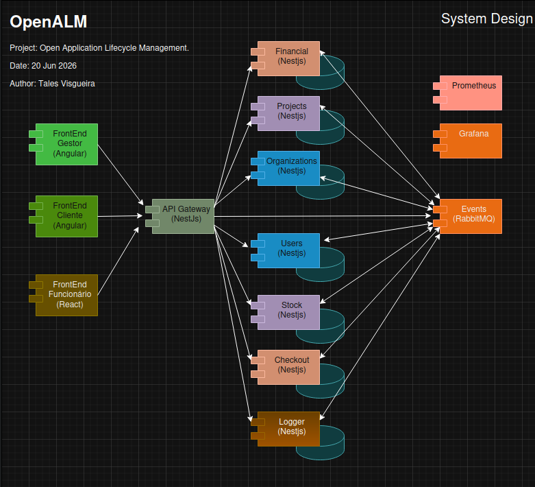

#  Gerenciamento do ciclo de vida das aplicações.


[](https://npmjs.org/package/@anthropic-ai/sdk)

O sistema OpenALM tem por finalidade gerenciar o ciclo de vida das aplicações (softwates), utilizando uma arquitetura de microserviços escaláveis e adaptativas para garantir uma gestão eficiente sobre as tarefas de  gerenciamento de projetos, pessoal, tarefas de implementações dos produtos, venda/localção e manutenção dos softwares.

## Arquitetura do projeto

<p align="center">
  
  <br/>
</p>

## LICENÇA DE USO

Este projeto está licenciado sobre a licença MIT. Veja em [LICENSE](./docs/LICENSE) file for details.

## SUMÁRIO

- [ Gerenciamento do ciclo de vida das aplicações.](#-gerenciamento-do-ciclo-de-vida-das-aplicações)
  - [Arquitetura do projeto](#arquitetura-do-projeto)
  - [LICENÇA DE USO](#licença-de-uso)
  - [SUMÁRIO](#sumário)
  - [RELEASES](#releases)
  - [DOCUMENTAÇÃO](#documentação)
  - [DEPENDÊNCIAS](#dependências)
    - [INSTALAÇÃO](#instalação)
    - [BUILDS DAS LIBS E APLICAÇÕES](#builds-das-libs-e-aplicações)
    - [INSTALAR POSTGRES, RABBITMQ, PROMETEUS E GRAFANA](#instalar-postgres-rabbitmq-prometeus-e-grafana)
    - [CONFIGURAR O ACESSO AOS BD E RABBITMQ](#configurar-o-acesso-aos-bd-e-rabbitmq)
    - [INICIALIZAR APLICAÇÕES](#inicializar-aplicações)
  - [MÓDULOS DO SISTEMA](#módulos-do-sistema)
  - [CONTRIBUIÇÕES](#contribuições)


## RELEASES

See [CHANGELOG.md](./docs/CONTRIBUTING.md).

| RELEASES | DATE| TYPE | LINK |
|---|---|---|---|
| v0.1.0 | 2026-08-20 | CANDIDATE | [Detalhe](docs/CHANGELOG.md/#010-2023-07-11)  |
| v1.0.0 | 2027-01-01 | RELEASE | [Detalhe](docs/CHANGELOG.md/#100-2023-07-11)  |

## DOCUMENTAÇÃO

Mais informações no link **[openALM.com](https://openalm.com)**.


## DEPENDÊNCIAS

- Node.js: v24.17.0
- Pnpm: v11.8.0
- Typescript: v6.0.2
- Vitest: v4.1.8
- Nestjs: v11.0.1
- Angular: v22.0.2
- React: 19.2.4
- Nextjs: 19.2.6
- Amqplib: v2.0.1
- PostgreSql: v17
- Prometheus: v3.12.0
- Grafana: v13.0.2

### INSTALAÇÃO

```sh
pnpm install
```

### BUILDS DAS LIBS E APLICAÇÕES

```sh
pnpm pnpm --filter "./libs/**" run build

pnpm pnpm --filter web run build
```

### INSTALAR POSTGRES, RABBITMQ, PROMETEUS E GRAFANA

```sh
docker compose up -d
```

### CONFIGURAR O ACESSO AOS BD E RABBITMQ

### INICIALIZAR APLICAÇÕES

```sh
pnpm start
```

## MÓDULOS DO SISTEMA

| MÓDULO | FINALIDADE| TIPO | LINK |
|---|---|---|---|
| API Gateway | Porta de entrada do sistema | Backend | [Detalhe](apps/gateway/README.md)  |
| Organizations | Microserviço de gerenciamento das organizações | Backend | [Detalhe](apps/organizations/README.md)  |
| Users | Microserviço de gerenciamento dos usuários | Backend | [Detalhe](apps/users/README.md)  |
| Projects | Microserviço de gerenciamento dos projetos | Backend | [Detalhe](apps/projects/README.md)  |
| Financial | Microserviço de gerenciamento financeiro | Backend | [Detalhe](apps/financial/README.md)  |
| Stock | Microserviço de gerenciamento do estoque de produtos | Backend | [Detalhe](apps/stocks/README.md)  |
| Checkout | Microserviço de carrinho de compra | Backend | [Detalhe](apps/checkouts/README.md)  |
| Logger | Microserviço para registro dos logs | Backend | [Detalhe](apps/logger/README.md)  |
| Manager | Aplicação de gerenciamento do gestor | Frontend | [Detalhe](apps/gestor/README.md)  |
| Customer | Aplicação das empresas clientes | Frontend | [Detalhe](apps/filial/README.md)  |
| Worker | Aplicação para uso pelos funcionários | Frontend | [Detalhe](apps/worker/README.md)  |

## CONTRIBUIÇÕES

See [CONTRIBUTING.md](./docs/CONTRIBUTING.md).

